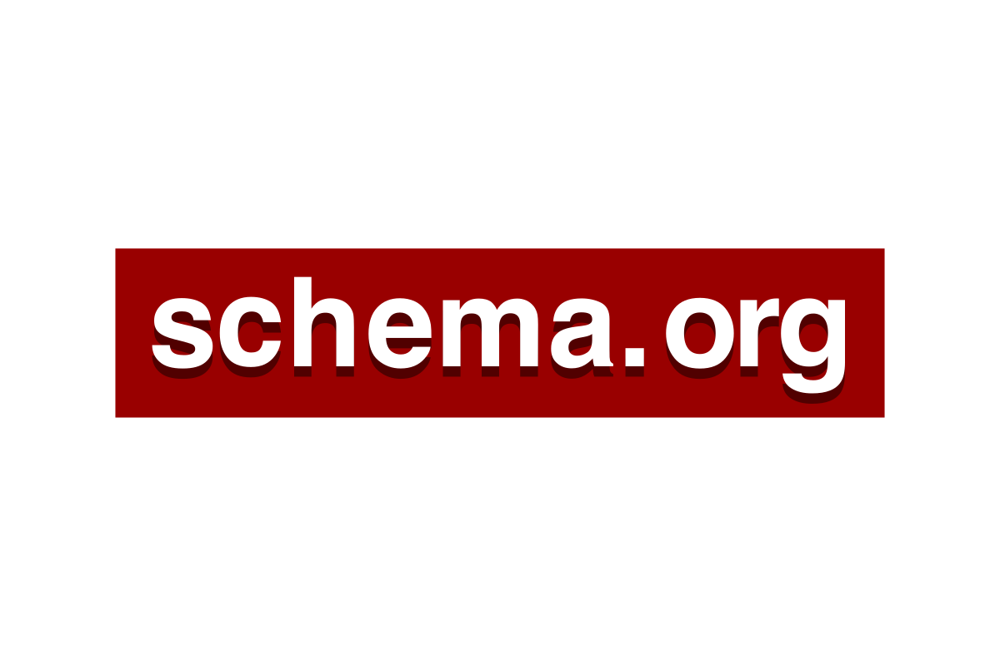

# Hi there! 👋 I'm Carlos

### Full-Stack Developer Student | Building Accessible & Scalable Solutions

📍 **Estepona, Málaga, Spain** | 💼 **Open to Junior Developer Opportunities** | 🎓 **Web Application Development**

---

## 🚀 About Me
🎯 Full-Stack Developer passionate about creating accessible and scalable web solutions
🔥 Currently building an ERP Smart System and collaborating on tourism accessibility projects
🏗️ Self-hosting enthusiast - I built and maintain my own server infrastructure
🌱 Expanding skills in React, Laravel, and modern DevOps practices
💡 Always exploring new technologies and contributing to meaningful projects

> *"The best way to predict the future is to create it."*

---

## 💻 Tech Stack & Expertise

### 🔥 **Core Technologies**
<table>
<tr>
<td align="center" width="25%">
<h4>Languages</h4>

</td>
<td align="center" width="25%">
<h4>Frameworks</h4>

</td>
<td align="center" width="25%">
<h4>Tools</h4>

</td>
<td align="center" width="25%">
<h4>Systems</h4>

</td>
</tr>
</table>

### 🌱 **Currently Learning**

---

## 🎯 Featured Projects

<table>
<tr>
<td width="50%">

### 🌟 IncluYete Estepona
**Accessibility Tourism Platform**
- Collaboration with Estepona City Council
- Focus on accessible tourism solutions
- Full-stack web development

🔗 [Organization](https://github.com/AsociacionIncluyete)

</td>
<td width="50%">

### ⚡ Smart ERP Portfolio
**Comprehensive Business Management**
- Custom ERP system showcasing skills
- Modern full-stack architecture
- Self-hosted deployment

🔗 [Live Demo](https://porfolio.duckdns.org/)

</td>
</tr>
</table>

---

## 🛠️ Infrastructure & DevOps

### 🏠 **Self-Hosted Server**
Built and maintain my own server infrastructure with comprehensive documentation

**Tech Stack:** Orange Pi 5 Plus | Linux | Docker | Self-hosting

🔗 [Server Documentation](https://server-doc.duckdns.org/) | [Repository](https://github.com/eChrls/orange-pi5plus-server-docs)

---

## 📊 GitHub Analytics

<table>
<tr>
<td>

</td>
<td>

</td>
</tr>
<tr>
<td colspan="2" align="center">

</td>
</tr>
</table>

---

## 🎓 Education & Experience

- 🎯 **Higher Technician Diploma** - Web Application Development
- 💼 **Internship** - IDB Mobile Technology
- 🌍 **Languages:** Spanish (Native), English (Certified High Level)
- 📚 **Continuous Learning** - Always exploring new technologies

---

## 🤝 Let's Connect!

**I'm actively seeking Junior Developer opportunities!**

Whether you're interested in **collaboration**, **mentorship**, or have an **exciting opportunity** to share, I'd love to hear from you.

**Available for:** Remote | On-site | Hybrid positions

---

*"Building the web, one commit at a time"* ⚡

