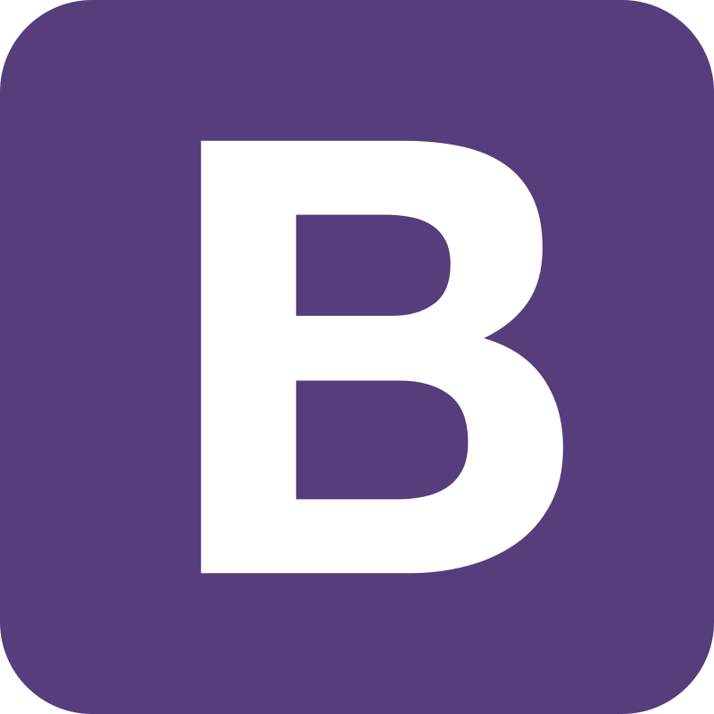
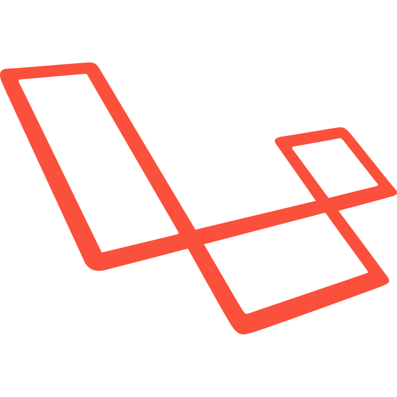
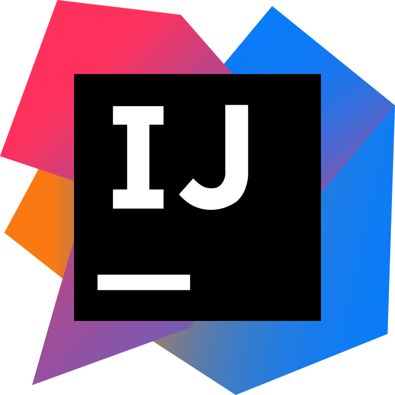
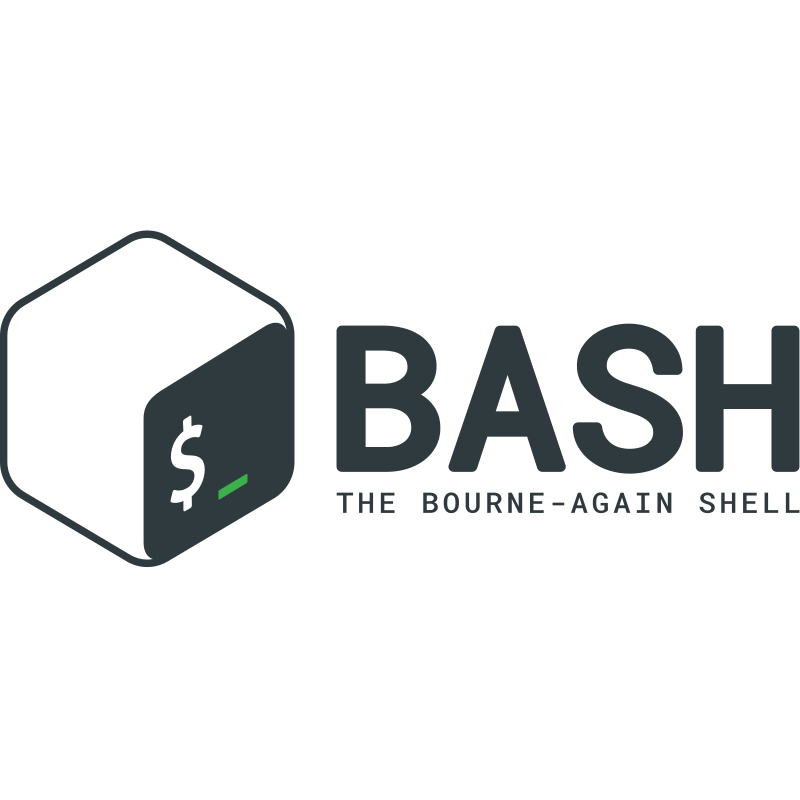

## **Full-Stack Developer Student** | **Building Accessible & Scalable Solutions**

### **Estepona, Málaga, Spain** | **Available for Junior Developer Opportunities**

---

## About Me

**Full-Stack Developer** passionate about creating **accessible** and **scalable** web solutions

Currently building an **ERP Smart System** and collaborating on **tourism accessibility** projects

**Self-hosting enthusiast** — I built and maintain my own server infrastructure on Orange Pi 5 Plus

Expanding skills in **React**, **Laravel**, **Kubernetes** and modern **DevOps** practices

Always exploring new technologies and contributing to **meaningful projects**

---

## Technical Stack

### Languages & Frameworks

<table>
<tr>
<td align="center" width="50%">
<h4>Frontend</h4>

</td>
<td align="center" width="50%">
<h4>Backend & Database</h4>

</td>
</tr>
</table>

### Development Environment & Infrastructure

<table>
<tr>
<td align="center" width="25%">
<h4>IDEs & Editors</h4>

</td>
<td align="center" width="25%">
<h4>DevOps & Containers</h4>

</td>
<td align="center" width="25%">
<h4>Servers & Networking</h4>

</td>
<td align="center" width="25%">
<h4>Scripting & OS</h4>

</td>
</tr>
</table>

---

## Featured Projects

### ♿ Incluyete Estepon@
**Tourism Accessibility Platform**
- Collaboration with **Estepona City Council** to improve inclusive tourism
- Full-stack development: REST API with Spring Boot + frontend with React
- Focused on enhancing accessibility for people with disabilities across tourist spots
- Integration with local services and interactive accessibility maps

**Organization:** [AsociacionIncluyete](https://github.com/AsociacionIncluyete)

---

### Smart ERP System
**Comprehensive Business Management Solution**
- Custom Enterprise Resource Planning system showcasing full-stack capabilities
- Modern microservices architecture with containerized deployments
- Self-hosted on custom server infrastructure with CI/CD pipelines
- Modules: inventory, reporting, user management, and more

**Live Demo:** [webportfolio.app](https://webportfolio.app/)

---

## Infrastructure & DevOps

### Self-Hosted Server Infrastructure
Built and maintain a production-grade server infrastructure using **Orange Pi 5 Plus** hardware. The stack runs fully containerized services with automated deployments, reverse proxying, and complete documentation.

**Technical Implementation:**
- **Hardware:** Orange Pi 5 Plus single-board computer
- **OS:** Linux Ubuntu Server
- **Containerization:** Docker + Kubernetes for orchestration
- **Reverse Proxy:** Traefik for automatic SSL and routing
- **Web Servers:** Nginx & Apache for static and dynamic content
- **Monitoring:** System health dashboards and performance tracking

**Documentation:** [server-doc.duckdns.org](https://server-doc.duckdns.org/)
**Repository:** [orange-pi5plus-server-docs](https://github.com/eChrls/orange-pi5plus-server-docs)

---

## Currently Learning

- **Advanced React** — hooks, context, performance optimization
- **Laravel** — Filament, Livewire, API development
- **Kubernetes** — cluster management, Helm charts, scaling strategies
- **Cloud fundamentals** — exploring AWS/GCP for hybrid self-hosted deployments

---

## GitHub Analytics

---

## Education & Experience

- **Higher Technician Diploma** — Web Application Development (DAW)
- **Internship** — IDB Mobile Technology
- **Self-directed learning** — Docker, Kubernetes, Laravel, React (Udemy, freeCodeCamp, official docs)
- **Open Source Contributor** — Incluyete Estepon@ accessibility platform

---

## Let's Connect

**I'm actively seeking Junior Developer opportunities!**

**Available for:** Remote | On-site | Hybrid positions

